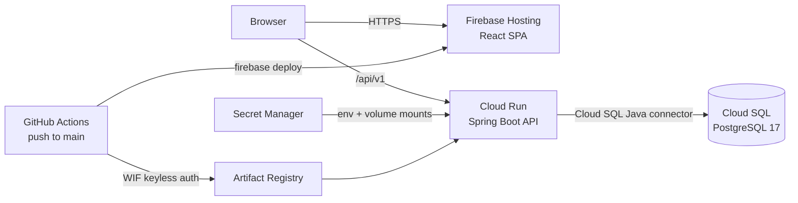

# Pork Fiction

*Making vegetarians question their life choices since 2026.*

A mock restaurant website built as a full-stack skills project using current
(2026) enterprise standards: public menu, table reservations, online ordering
with mock payment, and a role-protected admin dashboard — deployed to Google
Cloud with keyless continuous delivery.

**Live demo:** https://project-8eb99a34-6c1b-48be-9a2.web.app
· API docs: [`/swagger-ui.html`](https://restaurant-api-729631573980.us-central1.run.app/swagger-ui.html)

## Architecture



| Layer | Tech |
|---|---|
| Backend | Java 25 · Spring Boot 4.1 · Spring Security 7 (JWT resource server, local `NimbusJwtEncoder`) · Spring Data JPA · Flyway · springdoc-openapi |
| Frontend | React 19 · TypeScript · Vite 8 · React Router 8 (data mode) · TanStack Query 5 · Zustand · react-hook-form + zod 4 · Tailwind CSS 4 |
| API contract | springdoc OpenAPI spec → `@hey-api/openapi-ts` generates the typed client + TanStack Query options (`npm run generate:api`) |
| Database | PostgreSQL 17 (local: Docker · prod: Cloud SQL `db-f1-micro`) |
| Infra | Docker · GitHub Actions · Workload Identity Federation · Cloud Run · Artifact Registry · Secret Manager · Firebase Hosting |

The backend is a package-by-feature modular monolith (`menu`, `reservations`,
`orders`, `auth`): entities and repositories are package-private, features talk
through services, money is integer cents end-to-end, errors are RFC 9457
Problem Details, and the schema is owned by Flyway (`ddl-auto=validate`).

## Local development

Inner loop (fast HMR + IDE restarts):

```bash
docker compose up -d postgres          # database
cd backend && ./mvnw spring-boot:run   # API on :8080 (local profile is default)
cd frontend && npm run dev             # SPA on :5173, /api proxied to :8080
```

Whole app in containers (what CI's e2e job runs; stop a host API on :8080 first):

```bash
docker compose --profile full up --build   # web on :8081, api on :8080
```

Dev conveniences (local profile only — none of this exists in prod):

- Admin login: `admin@porkfiction.example` / `admin123` (seeded from
  `db/seed`, which prod's Flyway config never loads)
- Mock checkout: any 16-digit card, e.g. `4111 1111 1111 1111`;
  `4000 0000 0000 0002` simulates a decline (HTTP 402)
- Swagger UI: http://localhost:8080/swagger-ui.html

## Testing

```bash
cd backend && ./mvnw verify    # unit + @WebMvcTest slices + Testcontainers
                               # integration tests against real Postgres 17
cd frontend && npm test        # Vitest + Testing Library
cd frontend && npm run e2e     # 3 Playwright smoke journeys against the
                               # docker-compose full profile (start it first)
```

The e2e journeys: guest books a table; new customer registers → orders →
watches the status timeline; admin creates a dish → it appears on the public
menu.

## CI/CD

- **Pull requests** run `ci.yml`: backend verify, frontend
  lint/format/typecheck/test/build, Docker image builds, and the Playwright
  suite against the composed stack. All four are required checks on `main`.
- **Pushes to `main`** run `deploy.yml`: the same tests gate a deploy — the
  backend image is built on the runner, pushed to Artifact Registry, and
  rolled out to Cloud Run (image-only update; service config persists), then
  the SPA is built with the production API URL and deployed to Firebase
  Hosting. Backend always ships before frontend.
- **No service-account keys exist.** GitHub's OIDC tokens are exchanged for
  short-lived GCP credentials via Workload Identity Federation, restricted to
  this repository by an attribute condition.

## Cloud environment

One GCP project runs everything: Cloud Run (`min-instances=0`, 1 GiB) connects
to Cloud SQL through the Java connector under a dedicated runtime service
account; the database password and JWT signing keys live in Secret Manager
(keys as volume-mounted PEMs — never env vars, which mangle newlines).
Artifact Registry keeps the last five images via cleanup policy.

Cost: roughly **$12–18/month, almost entirely Cloud SQL**. Cloud Run, Artifact
Registry, Secret Manager, and Firebase Hosting round to zero at demo traffic.
Teardown when done learning:

```bash
gcloud sql instances delete restaurant-db        # stops the meaningful spend
gcloud run services delete restaurant-api --region us-central1
```

## Deliberate simplifications (the enterprise-caveats section)

Documented trade-offs a production system would handle differently:

- **JWT in localStorage** with a 60-minute TTL and no refresh tokens. Real
  products keep access tokens in memory with an `HttpOnly` refresh cookie and
  rotation, or delegate to an IdP (Keycloak/Auth0/Entra) entirely —
  localStorage is readable by any XSS payload.
- **Mock payment.** Card fields are shape-validated and never stored, logged,
  or sent anywhere; a real integration would tokenize with a provider (Stripe)
  and never let card numbers touch the backend.
- **JVM cold starts (~3–10s)** are accepted to keep `min-instances=0`; pinning
  a warm instance costs ~$10–15/month.
- **Single role per user, no email verification, no rate limiting** on auth
  endpoints; order status uses 5-second polling rather than WebSockets/SSE.
- **Availability model** is a fixed table count per 30-minute slot — no table
  inventory, no party-size-aware capacity.
